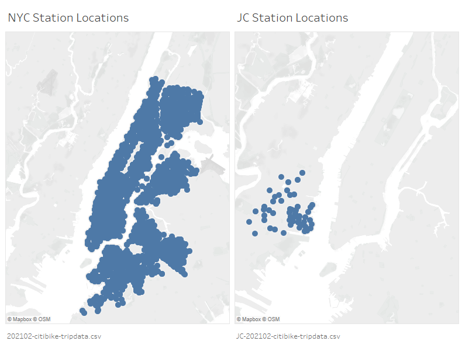

# tableau_citibike

-----

Note: This repository is under development.

## Project Overview
### Description
Analyze Citibike usage trends over time and identify anomalies within the data.

<mark>Add background on where the data came from
</mark>

### Packages Used
Python (pandas, requests, zipfile, io, splinter, beautiful soup, webdriver_manager, os)

Tableau Public

### Final Analysis Files
<mark>Add links to final files</mark>

## Project Discussion
## Citibike Station Locations
<mark>Add discussion and screen capture
</mark>
## Citibike Ridership Demographics
<mark>Add discussion and screen capture
</mark>
## Citibike Ridership Anomaly
<mark>Add discussion and screen capture
</mark>
## Citibike Average Rental Duration Anomaly
<mark>Add discussion and screen capture
</mark>
## Analysis challenges
<mark>Add discussion</mark>

## Project Details
### Project Content Descriptions and Analysis Process
* **a_Instructions**: Instructions for completing the assignment.
* **b_Data_Download**: Download the dataset

    * retrieve_data.ipynb - Used Python to scrape and download a list of urls for all of the citbike trip history csvs on <a href="https://s3.amazonaws.com/tripdata/index.html" target="_blank">https://s3.amazonaws.com/tripdata/index.html</a>
    
    * assess_data.ipynb and assess_data.pdf - Used Python and Pandas to determine that the data files had 3 distinct formats.

        131 Files had this format
        ```plaintext
        Data columns (total 16 columns):
         #   Column                   Non-Null Count  Dtype  
        ---  ------                   --------------  -----  
         0   tripduration             131 non-null    int64  
         1   starttime                131 non-null    object 
         2   stoptime                 131 non-null    object 
         3   start station id         131 non-null    int64  
         4   start station name       131 non-null    object 
         5   start station latitude   131 non-null    float64
         6   start station longitude  131 non-null    float64
         7   end station id           131 non-null    int64  
         8   end station name         131 non-null    object 
         9   end station latitude     131 non-null    float64
         10  end station longitude    131 non-null    float64
         11  bikeid                   131 non-null    int64  
         12  usertype                 131 non-null    object 
         13  birth year               128 non-null    object 
         14  gender                   131 non-null    int64
        ```

        25 files from 2016 and 2017 had this format
        
        ```plaintext
        Data columns (total 16 columns):
         #   Column                   Non-Null Count  Dtype  
        ---  ------                   --------------  -----  
         0   Trip Duration            25 non-null     int64  
         1   Start Time               25 non-null     object 
         2   Stop Time                25 non-null     object 
         3   Start Station ID         25 non-null     int64  
         4   Start Station Name       25 non-null     object 
         5   Start Station Latitude   25 non-null     float64
         6   Start Station Longitude  25 non-null     float64
         7   End Station ID           25 non-null     int64  
         8   End Station Name         25 non-null     object 
         9   End Station Latitude     25 non-null     float64
         10  End Station Longitude    25 non-null     float64
         11  Bike ID                  25 non-null     int64  
         12  User Type                25 non-null     object 
         13  Birth Year               25 non-null     int64  
         14  Gender                   25 non-null     int64
        ```
        
        10 Files from 2021 had this format
        ```plaintext
        Data columns (total 14 columns):
         #   Column              Non-Null Count  Dtype  
        ---  ------              --------------  -----  
         0   ride_id             10 non-null     object 
         1   rideable_type       10 non-null     object 
         2   started_at          10 non-null     object 
         3   ended_at            10 non-null     object 
         4   start_station_name  10 non-null     object 
         5   start_station_id    10 non-null     object 
         6   end_station_name    10 non-null     object 
         7   end_station_id      10 non-null     object 
         8   start_lat           10 non-null     float64
         9   start_lng           10 non-null     float64
         10  end_lat             10 non-null     float64
         11  end_lng             10 non-null     float64
         12  member_casual       10 non-null     object
        ```

* **c_Data_Exploration**: Explore the data

    * Investigate_JC_files: Determined there are csvs for two cities within the dataset in Tableau by plotting station locations on a map.
        * New York City Trip Data: YYYYMM-citibike-tripdata.csv
        * Jersey City Trip Data: JC-YYYYMM-citibike-tripdata.csv
        
        
        * citibike_location_assessment.twbx: Tableau workbook associated with <a href="https://public.tableau.com/app/profile/nicole.lund/viz/citibikelocationassessment/StationLocations" target="_blank">https://public.tableau.com/app/profile/nicole.lund/viz/citibikelocationassessment/StationLocations</a>

    * Investigate_small_files: Investigate two small csv files (201801 & 201901) in Tableau to identify data patterns of interest prior to expanding to larger data sets.
        * combine_files.ipynb: Uses Python and Pandas to append two csvs with consistent data contents.  Prepares data columns for Tableau to avoid Tableau calculations as much as possible.
        * citibike_small_data_set.twbx: Tableau workbook associated with <a href="https://public.tableau.com/app/profile/nicole.lund/viz/citibikesmalldataset/Dashboard1" target="_blank">https://public.tableau.com/app/profile/nicole.lund/viz/citibikesmalldataset/Dashboard1</a>
        
    * Investigate_expansion_to_larger_files: Investigate replacing the data from citibike_small_data_set.twbx 4 with more csv files (201801, 201901, 202001 & 202101) in Tableau to identify any issues with expanding to larger data sets.  This step identified the need to prepare calculations in Python prior to importing into Tableau.
        * combine_files.ipynb: This file is the same as the file in Investigate_small_files.
        * citibike_larger_data_set.twbx: Tableau workbook associated with <a href="https://public.tableau.com/app/profile/nicole.lund/viz/citibikelargerdataset/Durationhttps://public.tableau.com/app/profile/nicole.lund/viz/citibikelargerdataset/Duration" target="_blank">https://public.tableau.com/app/profile/nicole.lund/viz/citibikelargerdataset/Duration</a>

* **d_Data_Cleanup**: Prepare the final data for Tableau import. This was done in several iterations due to Tableau file size constraints.
    * Initially chose all data from 2018 and 2019 for analysis because these files have consistent formatting and are not disrupted by effects from the Covid-19 pandemic.
    * Second pass restricted data to 2018 only and still found the dataset to be too large.
    * Final pass restricted data to December 2017 thru September 2018 in order to include 1 full winter season, 1 full summer season and as many months as possible for time series analyses.
        * maximum_file_size: Monthly data files folder
            * assess_chosen_data.ipynb: Confirm chosen data files have consistent formatting.
            * combine_files.ipynb: Uses Python and Pandas to append two csvs with consistent data contents.  Prepares data columns for Tableau to avoid Tableau calculations as much as possible. This file expands upon the same file contained in Investigate_small_files, but includes a minor correction needed for analyzing December 2017 datetime format.
* **images**: Screen captures of analysis results.
* **.gitignore**: Gitignore includes standard gitignore Python files and
    * All CSV files as they are too large to upload to Github
    * Final Tableau Workbook as it is also too large to upload to Github
* **License**: Standard MIT license

