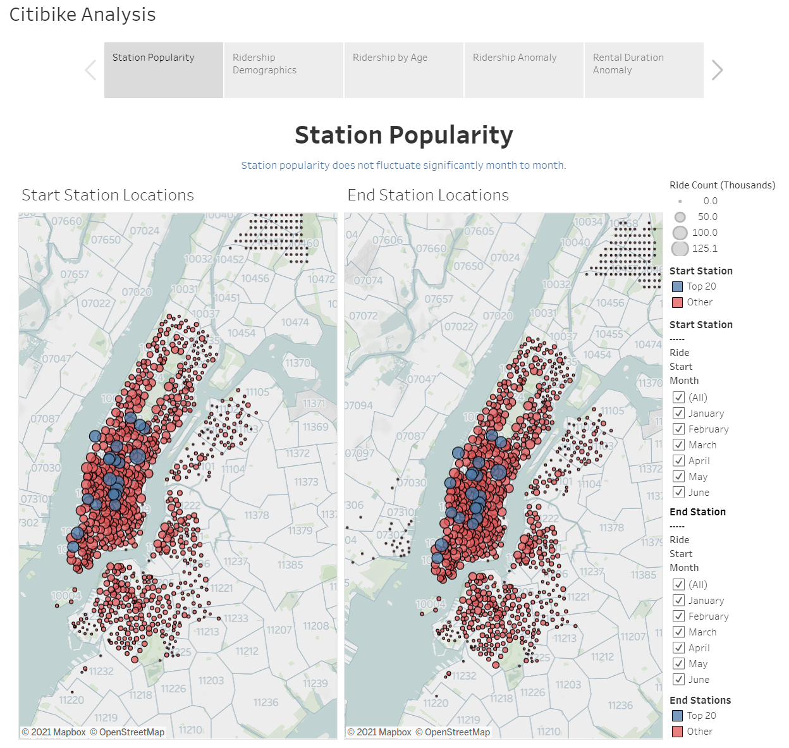
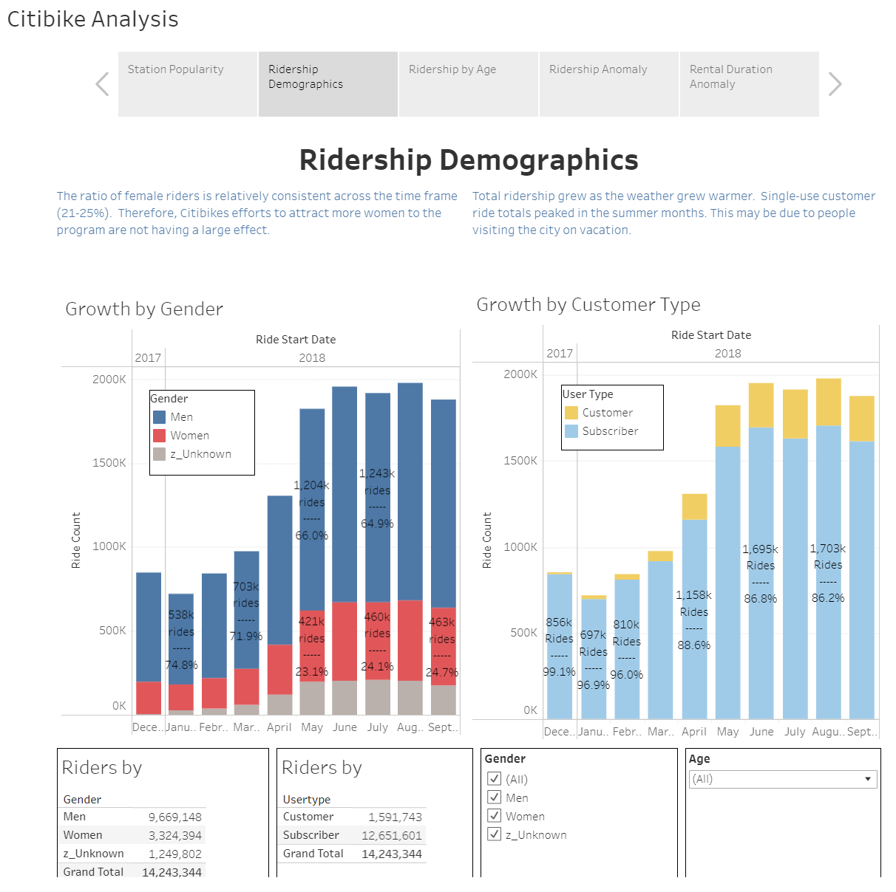
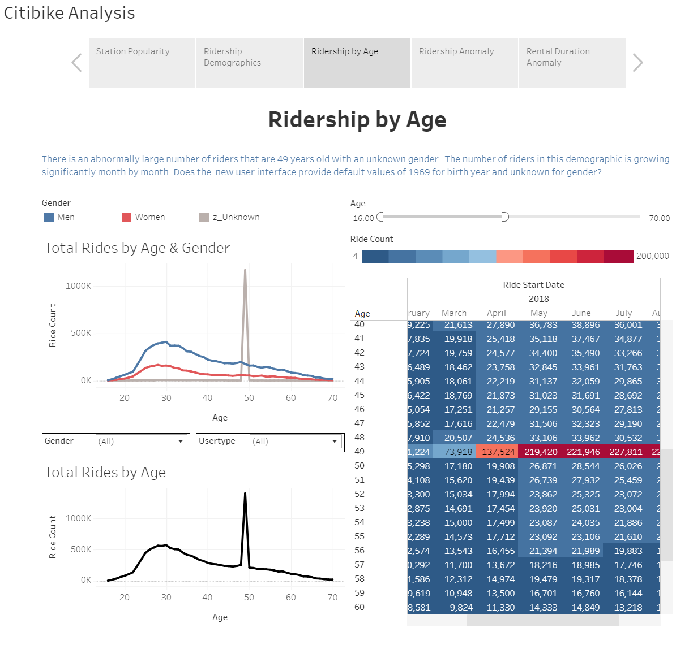
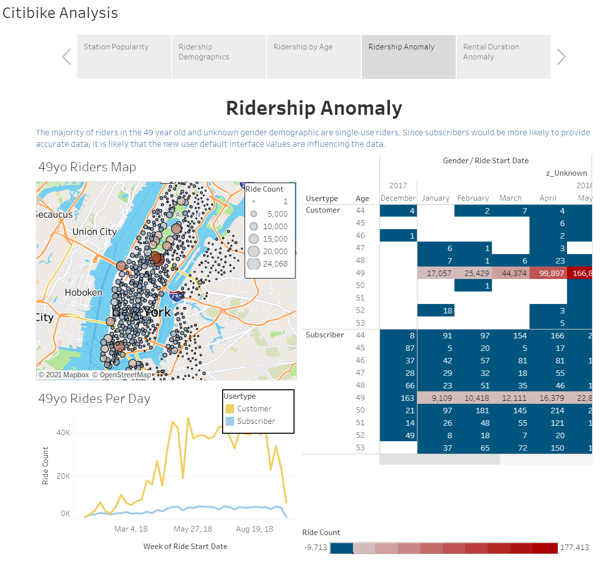
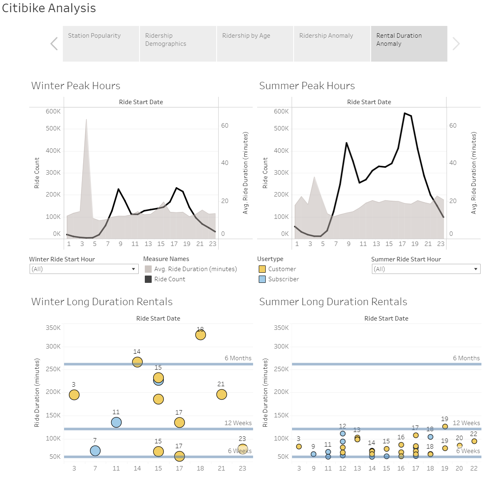

# tableau_citibike
Note: This repository is under development.

-----

## Project Overview

### Description
Citibike freely shares their user data so data enthusiasts can review and analyze it.  The analysis presented here reviews Citibike usage trends over time and attempts to identify usage anomalies within the data.

The Citibike dataset can be found at <a href="https://www.citibikenyc.com/system-data" target="_blank">https://www.citibikenyc.com/system-data</a>

### Packages Used
Python (pandas, requests, zipfile, io, splinter, beautiful soup, webdriver_manager, os)

Tableau Public

### Final Analysis Files

* Tableau Public Analysis: <a href="https://public.tableau.com/app/profile/nicole.lund/viz/citibikeanalysis12-2017to09-2018/CitibikeAnalysis" target="_blank">https://public.tableau.com/app/profile/nicole.lund/viz/citibikeanalysis12-2017to09-2018/CitibikeAnalysis</a>

* Downloadable Analysis Files: <a href="https://drive.google.com/drive/folders/1Ng7EzqI54pu5td-DpVvGArRQfJB9Y-Re?usp=sharing" target="_blank">Google Drive Folder</a>
    * Downloadable Tableau Workbook (291Mb): <a href="https://drive.google.com/file/d/1L9s4-YGpS5W0MsXrJGRxdo2jagCdx4j6/view?usp=sharing" target="_blank">citibikeAnalysis_12-2017to09-2018.twbx</a>
    * Downloadable Processed Data File (2.8Gb): <a href="https://drive.google.com/file/d/1Ie4xxkMv6wdAOn57sSizIAGNoK46aFYt/view?usp=sharing" target="_blank">2017-12_to_2018-09_citibike_trip_data.csv</a>

-----

## Project Discussion

<mark>Add discussion</mark>

## Citibike Station Locations
In order to provide the user with the best service, Citibike is interested in maintaining an adequate supply of bikes at the most popular stations.  The Station Popularity dashboard identifies the most popular stations to start and end a ride based on the number of rides associated with that location. Each map on the dashboard can be filtered to show between 1 and all months of data.  Note, that the December data is from 2017 to ensure a continuous dataset.  Zip code data is also provided as a reference to orient the user on the map.  There are minor shifts in popular stations from month to month.



## Citibike Ridership Demographics
The most basic user data that indicates the health of Citibike as a company is the number of rides taken by riders.  The Ridership Demographics dashboard shows a time-series analysis of the number of rides taken for each Gender and for each User Type.  Total ridership more than doubled from the winter to the summer months. The growth could be explained by seasonality of pleasant riding conditions. To further understand growth trend, multiple years of data would need to be assessed outside of Tableau Public due to file size constraints by the platform.

The data presented shows a few interesting items of note:

* The percentage of female riders is relatively consistent across the time period. Female riders account for 21-25% of all riders. Any campaigns by Citibike to increase women's interest in the program are not significantly increasing rides. The growth trend is more in line with overall ridership growth over the period.

* The percentage of "Customer" user type does significantly increase between the winter and summer months. The "Customer" user type is defined as a user that purchases rides a-la-carte rather than as a subscription. This is likely indicative of riders visiting the area on vacation.



## Citibike Ridership by Age

A couple of anomalies were discovered when reviewing the number of rides taken by users of different age groups.  It appears as though the user's age is self-reported rather than through an external verification check.  There are age entries up to 133 years old.  Any entries greater than 80-90 years old are circumspect. The largest anomaly is a spike in ride count in the 49 year old and unknown gender group. That spike is double the maximum for any other age.  This phenomenon is investigated in further detail later.   



## Ridership Anomaly
The age data revealed an anomaly in the number of rides taken by 49 year old people that did not identify a gender. This spike in ride counts indicates that the new user interface is designed with default entries for birth year (1969) and Gender (unknown).  It is reasonable to believe that riders may not wish to take the time to fill in every entry in the new user form or did not want to reveal sensitive personal information and allowed default values to be set in their accounts. Further analysis indicates that the lion share of rides with this demographic combination fell under the "Customer" user type and a smaller but still significant number of "Subscriber" user type rides.



## Citibike Average Rental Duration Anomaly

In addition to understanding which stations are most popular within the city, it is also important for Citibike to understand the usage trends of their bicycles on a daily basis. The Rental Hours dashboard investigates the hours in which rides are initiated and the average duration of those rides.  Regardless of season, the peak times for riders to start a ride align with typical rush hour times as would be expected. 

A surprising anomaly was discovered when looking at the average ride duration over the period of the day. There are abnormally high averages in the early morning hours.  Median duration rentals (not shown) were more consistent throughout the day and did not reveal any interesting anomalies. To investigate the average duration anomaly further, the duration of individual rentals were reviewed.  It was discovered that the average ride duration was elevated due to exceptionally long rentals.  That elevation is most prominent in the hours of the day with the fewest number of rides occurring.  Note, there is a reduction in the number of rentals exceeding 12 weeks between the winter and summer months. Perhaps Citibike instituted a policy to identify long rentals and pursue returns of the missing bikes.



## Miscellaneous Analysis

The following analysis was performed, but not included in the final assessment:
* Age vs Ride Duration: The Age vs Ride Duration chart on "Index-Miscellaneous 1" dashboard shows a relatively short median ride time and another view of the excessively long duration rentals discussed previously. 

* Age vs Ride Distance: The Age vs ride distance analysis was performed on the smaller data sets, but the calculations required to assess ride distance could not be completed on the final data set. The analysis shows an average distance rode of 1 mi, which makes sense for the the New York City area.

* Bikes Needing Maintenance: The computation intensive distance calculation was also used to review if individual bikes needed maintenance.  There were instances of bikeids with total distances rode that exceeded 500 miles.  The data was displayed as bikeid vs total distance with bike with bikes needing maintenance highlighted. There were not any items of note in the assessment to warrant further investigation.

* Top and Bottom 10 Stations: The top and bottom stations to start or end a trip were also reviewed, but did not improve upon the station popularity dashboard shown previously. This dashboard is included in "Index-Miscellaneous 2" for interested individuals.

## Analysis challenges

<mark>Add discussion</mark>

-----

## Project Details

### Project Content Descriptions and Analysis Process

* **a_Instructions**: Instructions for completing the assignment.
* **b_Data_Download**: Download the dataset

    * retrieve_data.ipynb - Used Python to scrape and download a list of urls for all of the citbike trip history csvs on <a href="https://s3.amazonaws.com/tripdata/index.html" target="_blank">https://s3.amazonaws.com/tripdata/index.html</a>
    
    * assess_data.ipynb and assess_data.pdf - Used Python and Pandas to determine that the data files had 3 distinct formats

        131 Files had this format
        ```plaintext
        Data columns (total 16 columns):
         #   Column                   Non-Null Count  Dtype  
        ---  ------                   --------------  -----  
         0   tripduration             131 non-null    int64  
         1   starttime                131 non-null    object 
         2   stoptime                 131 non-null    object 
         3   start station id         131 non-null    int64  
         4   start station name       131 non-null    object 
         5   start station latitude   131 non-null    float64
         6   start station longitude  131 non-null    float64
         7   end station id           131 non-null    int64  
         8   end station name         131 non-null    object 
         9   end station latitude     131 non-null    float64
         10  end station longitude    131 non-null    float64
         11  bikeid                   131 non-null    int64  
         12  usertype                 131 non-null    object 
         13  birth year               128 non-null    object 
         14  gender                   131 non-null    int64
        ```

        25 files from 2016 and 2017 had this format
        
        ```plaintext
        Data columns (total 16 columns):
         #   Column                   Non-Null Count  Dtype  
        ---  ------                   --------------  -----  
         0   Trip Duration            25 non-null     int64  
         1   Start Time               25 non-null     object 
         2   Stop Time                25 non-null     object 
         3   Start Station ID         25 non-null     int64  
         4   Start Station Name       25 non-null     object 
         5   Start Station Latitude   25 non-null     float64
         6   Start Station Longitude  25 non-null     float64
         7   End Station ID           25 non-null     int64  
         8   End Station Name         25 non-null     object 
         9   End Station Latitude     25 non-null     float64
         10  End Station Longitude    25 non-null     float64
         11  Bike ID                  25 non-null     int64  
         12  User Type                25 non-null     object 
         13  Birth Year               25 non-null     int64  
         14  Gender                   25 non-null     int64
        ```
        
        10 Files from 2021 had this format
        ```plaintext
        Data columns (total 14 columns):
         #   Column              Non-Null Count  Dtype  
        ---  ------              --------------  -----  
         0   ride_id             10 non-null     object 
         1   rideable_type       10 non-null     object 
         2   started_at          10 non-null     object 
         3   ended_at            10 non-null     object 
         4   start_station_name  10 non-null     object 
         5   start_station_id    10 non-null     object 
         6   end_station_name    10 non-null     object 
         7   end_station_id      10 non-null     object 
         8   start_lat           10 non-null     float64
         9   start_lng           10 non-null     float64
         10  end_lat             10 non-null     float64
         11  end_lng             10 non-null     float64
         12  member_casual       10 non-null     object
        ```

* **c_Data_Exploration**: Explore the data

    * Investigate_JC_files: Determined there are csvs for two cities within the dataset in Tableau by plotting station locations on a map
        * New York City Trip Data: YYYYMM-citibike-tripdata.csv
        * Jersey City Trip Data: JC-YYYYMM-citibike-tripdata.csv
        
        
        * citibike_location_assessment.twbx: Tableau workbook associated with <a href="https://public.tableau.com/app/profile/nicole.lund/viz/citibikelocationassessment/StationLocations" target="_blank">https://public.tableau.com/app/profile/nicole.lund/viz/citibikelocationassessment/StationLocations</a>

    * Investigate_small_files: Investigated two small csv files (201801 & 201901) in Tableau to identify data patterns of interest prior to expanding to larger data sets
        * combine_files.ipynb: Used Python and Pandas to append two csvs with consistent data contents and prepare data columns for Tableau to avoid Tableau calculations as much as possible
        * citibike_small_data_set.twbx: Tableau workbook associated with <a href="https://public.tableau.com/app/profile/nicole.lund/viz/citibikesmalldataset/Dashboard1" target="_blank">https://public.tableau.com/app/profile/nicole.lund/viz/citibikesmalldataset/Dashboard1</a>
        
    * Investigate_expansion_to_larger_files: Investigated replacing the data from citibike_small_data_set.twbx  with more csv files (201801, 201901, 202001 & 202101) in Tableau to identify any issues with expanding to larger data sets.  This step identified the need to prepare calculations in Python prior to importing into Tableau.
        * combine_files.ipynb: This file is the same as the file in Investigate_small_files.
        * citibike_larger_data_set.twbx: Tableau workbook associated with <a href="https://public.tableau.com/app/profile/nicole.lund/viz/citibikelargerdataset/Durationhttps://public.tableau.com/app/profile/nicole.lund/viz/citibikelargerdataset/Duration" target="_blank">https://public.tableau.com/app/profile/nicole.lund/viz/citibikelargerdataset/Duration</a>

* **d_Data_Cleanup**: Prepared the final data for Tableau import. This was done in several iterations due to Tableau file size constraints.
    * Initially chose all data from 2018 and 2019 for analysis because these files have consistent formatting and are not disrupted by effects from the Covid-19 pandemic.
    * Second pass restricted data to 2018 only and still found the dataset to be too large.
    * Final pass restricted data to December 2017 thru September 2018 in order to include 1 full winter season, 1 full summer season and as many months as possible for time series analyses.
        * maximum_file_size: Monthly data files folder
            * assess_chosen_data.ipynb: Confirm chosen data files have consistent formatting.
            * combine_files.ipynb: Uses Python and Pandas to append two csvs with consistent data contents.  Prepares data columns for Tableau to avoid Tableau calculations as much as possible. This file expands upon the same file contained in Investigate_small_files, but includes a minor correction needed for analyzing December 2017 datetime format.
* **images**: Screen captures of analysis results.
* **.gitignore**: Gitignore includes standard gitignore Python files and
    * All CSV files as they are too large to upload to Github
    * Final Tableau Workbook as it is also too large to upload to Github
* **License**: Standard MIT license

